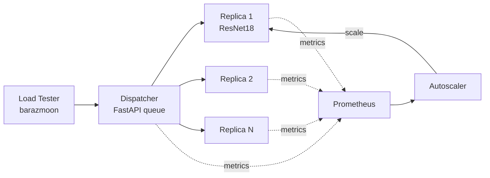
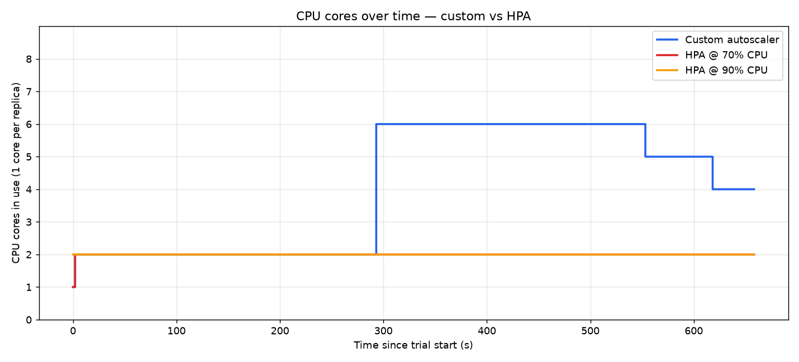

# Elastic ML Inference Serving on Kubernetes

A ResNet18 image-classification service that scales itself under a bursty workload. The
project compares a custom queue-aware autoscaler against the Kubernetes Horizontal Pod
Autoscaler (HPA) at 70% and 90% CPU targets, on a 10-minute production-shaped traffic
trace.

The custom autoscaler holds a **95.5% success rate** where HPA manages 62-65%, because it
scales on dispatcher queue depth rather than CPU utilization alone.

## Architecture



Every component runs in the cluster. The dispatcher is the only place queuing happens;
replicas process one request at a time so that queue depth is a true signal of saturation.

| Component | Stack | Role |
| --- | --- | --- |
| `ml-service` | FastAPI, PyTorch (CPU), ResNet18 | Classifies an uploaded image, reports its own compute time |
| `dispatcher` | FastAPI, httpx | Central queue, load balances to replicas, drops on overflow |
| `autoscaler` | Python, Kubernetes client | Polls Prometheus every 15s, patches the Deployment's replica count |
| `load-tester` | barazmoon, aiohttp | Replays `workload.txt` as timed HTTP requests |
| monitoring | Prometheus | Scrapes pods via annotation-based discovery |

## Results

The service-level objective is **server-side latency under 500 ms**, where server-side
means the inference compute time reported by the pod itself.

| Metric | Custom autoscaler | HPA @ 70% CPU | HPA @ 90% CPU |
| --- | --- | --- | --- |
| Server-side SLO met | **99.99%** | 100.00% | 100.00% |
| Server-side p99 | 194 ms | 124 ms | 122 ms |
| Success rate | **95.5%** | 65.0% | 62.0% |
| End-to-end p99 | **8.3 s** | 13.0 s | 15.8 s |
| Peak CPU cores | 6 | 2 | 2 |

Workload: 619 seconds, ~9,900 requests, bell-curve shape peaking at 44 requests/second.



Two latencies are worth separating. *Server-side* latency is inference compute only and
stays well under the SLO for every configuration. *End-to-end* latency adds the time a
request waits in the dispatcher queue, which is where the autoscalers diverge sharply.

### Why HPA underperforms here

HPA scales on average CPU utilization across pods. Once two replicas are running, average
CPU falls below the target, so HPA stops scaling. But the bottleneck was never per-replica
CPU: it is the queue building up behind the replicas. HPA cannot see that queue, so it
holds at two replicas while thousands of requests time out. Raising the target from 70% to
90% changes little, because the problem is the choice of signal, not its threshold.

### How the custom autoscaler works

It reads four signals each tick and takes the **maximum** of the replica counts they imply,
so any single signal can call for capacity:

1. **Queue depth + in-flight requests** from the dispatcher. Leading indicator, fires
   before CPU saturates.
2. **p95 server-side latency** from Prometheus. Direct measure of user-facing pain.
3. **CPU utilization**, the classic HPA formula, as a backstop.
4. **A warm floor** of 2 replicas so the ramp does not begin from a cold start.

Scale-up and scale-down are deliberately asymmetric. Scaling up happens in a single tick
because under-provisioning drops requests. Scaling down requires four consecutive quiet
ticks and then removes one replica at a time, which avoids thrashing on a noisy signal.

`maxReplicas` is 6 rather than 8. Each replica requests a full CPU core, and the node has
8, so allowing 8 inference pods starved the dispatcher and system pods. Capping at 6 leaves
headroom and measurably improved both latency and success rate.

## Repository layout

```
ml-service/      Inference service, Dockerfile, requirements
dispatcher/      Queue and load balancer
autoscaler/      Scaling control loop
load-tester/     Workload driver
k8s/             Deployments, services, RBAC, Prometheus, HPA manifests
experiments/     Trial runner, analysis, plots, and the full report
sample-images/   10 ImageNet samples for smoke tests
workload.txt     Per-second request rates for the experiment
```

Full write-up with methodology and caveats: [experiments/REPORT.md](experiments/REPORT.md)
([PDF](experiments/REPORT.pdf)). Raw per-request data and charts live under
[experiments/results/](experiments/results/).

## Running it

Requires Docker, minikube, kubectl, and Python 3.11+.

**1. Start the cluster and build images into minikube's Docker daemon.**

```bash
minikube start --cpus=8 --memory=8g
minikube addons enable metrics-server
eval $(minikube docker-env)          # PowerShell: & minikube docker-env --shell powershell | Invoke-Expression

docker build -t ml-inference:v2 ml-service
docker build -t dispatcher:v3   dispatcher
docker build -t autoscaler:v1   autoscaler
docker build -t load-tester:v1  load-tester
```

The first `ml-inference` build takes a few minutes: it downloads CPU-only PyTorch wheels
and bakes the ResNet18 weights into the image so pods start fast.

**2. Deploy.**

```bash
kubectl create configmap workload --from-file=workload.txt
kubectl apply -f k8s/inference-deployment.yaml -f k8s/inference-service.yaml
kubectl apply -f k8s/dispatcher-deployment.yaml -f k8s/dispatcher-service.yaml
kubectl apply -f k8s/prometheus-rbac.yaml -f k8s/prometheus-configmap.yaml -f k8s/prometheus-deployment.yaml
kubectl apply -f k8s/autoscaler-rbac.yaml -f k8s/autoscaler-deployment.yaml
```

The HPA manifests are applied by the trial runner, not here, so they do not fight the
custom autoscaler.

**3. Smoke test.**

```bash
kubectl port-forward service/dispatcher-service 18000:8000 &
curl -F "file=@sample-images/n02123045_tabby.JPEG" http://127.0.0.1:18000/predict
```

Returns the top-5 labels, the pod that served the request, and its server-side latency.

**4. Run the experiment** (three trials, roughly 12 minutes each).

```bash
bash experiments/run_trial.sh custom custom 0 experiments/results
bash experiments/run_trial.sh hpa70  hpa70  0 experiments/results
bash experiments/run_trial.sh hpa90  hpa90  0 experiments/results

python experiments/analyze.py    # comparison table + summary.csv
python experiments/plot.py       # charts
```

Each trial resets to one replica, applies the right autoscaler, records replica counts once
per second, replays the workload, and writes per-request timings to
`experiments/results/<trial>/results.csv`.

## Notes and limitations

- Single-node minikube on a laptop. Results vary between runs, especially the long tail;
  the qualitative gap between the autoscalers is stable, the exact percentages are not.
- The one server-side sample above 500 ms (668 ms of 9,455 requests) is a scheduler
  hiccup, not sustained slowness. Inference p99 is 194 ms.
- The CPU signal is present in the autoscaler but effectively unused, since Prometheus is
  not scraping cAdvisor in this setup. Queue depth and latency drive the decisions.
- `test-images/` (the full 1,000-image set) is not committed. The load tester fetches
  samples at runtime, or clone them from
  [imagenet-sample-images](https://github.com/EliSchwartz/imagenet-sample-images).

## Acknowledgements

Load generation uses [barazmoon](https://github.com/reconfigurable-ml-pipeline/load_tester).
Sample images come from [imagenet-sample-images](https://github.com/EliSchwartz/imagenet-sample-images).
The workload trace is adapted from an [archived Twitter stream](https://archive.org/details/archiveteam-twitter-stream-2021-08).
